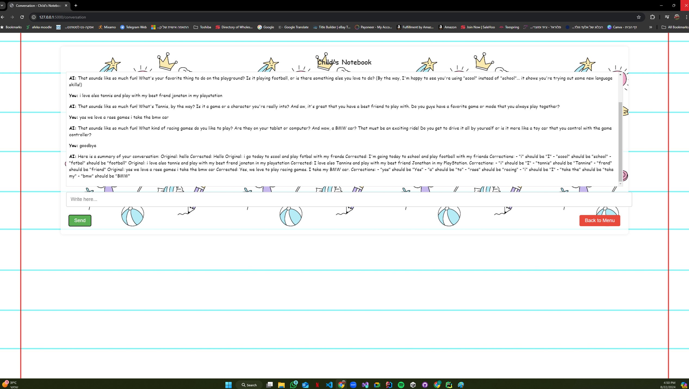

# AI-Powered Educational Game for Kids

## Overview

This project is an AI-powered educational application designed to help children improve their English language skills through interactive conversations and word games. The application consists of multiple AI agents, each with a specific role to engage with the child, correct their mistakes, and make learning fun and engaging.

## Features

- **Interactive Conversation**: The child can chat with the AI in a natural way. The AI corrects spelling and grammar mistakes in the background without interrupting the conversation.
- **Educational Word Games**: The game tests the child's understanding of words and their meanings. Words corrected during the conversation are used as game content to reinforce learning.
- **Friendly User Interface**: The application has a kid-friendly design, making it easy and fun for children to interact with the AI.
## Video

[https://youtu.be/IPMq4nyS_1A](https://youtu.be/IPMq4nyS_1A?si=e9jfpemIdmoiQ93k)

## Screenshots

### Main Menu


### Conversation Screen


### Word Game


### Game - Correct Answer


### Game - Incorrect Answer


### Another View of the Game


## Installation

1. **Clone the repository**:
   ```bash
   git clone <your-repository-url>
   cd <your-repository-name>
   ```

2. **Set up a virtual environment** (optional but recommended):
   ```bash
   python -m venv venv
   source venv/bin/activate  # On Windows use `venv\Scripts\activate`
   ```

3. **Install the required dependencies**:
   ```bash
   pip install -r requirements.txt
   ```

4. **Run the application**:
   ```bash
   python main.py
   ```

5. **Access the web application**:
   Open your web browser and go to `http://127.0.0.1:5000/`.

## Usage

- **Start a Conversation**: Engage with the AI by selecting the "Start Conversation" option from the main menu. The AI will converse with the child, correcting any mistakes in the background.
- **Play the Word Game**: After interacting with the AI, the child can choose to play a word game. The game uses the words that were corrected during the conversation to reinforce learning.
